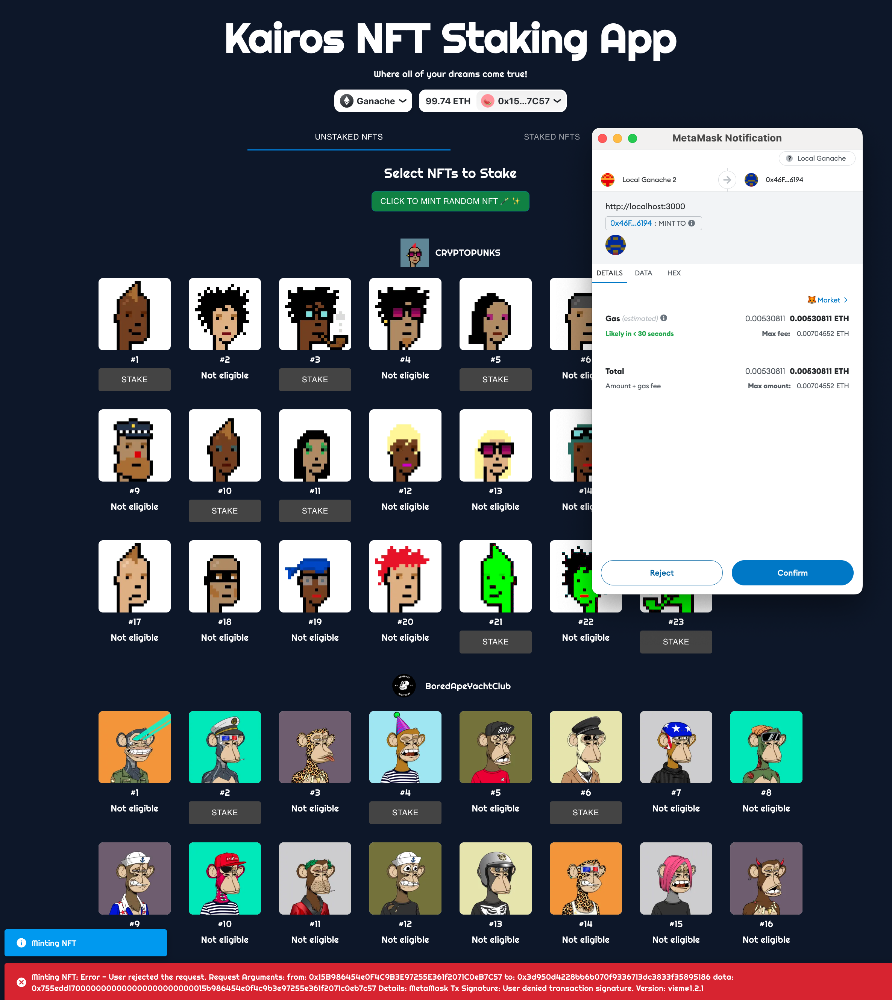
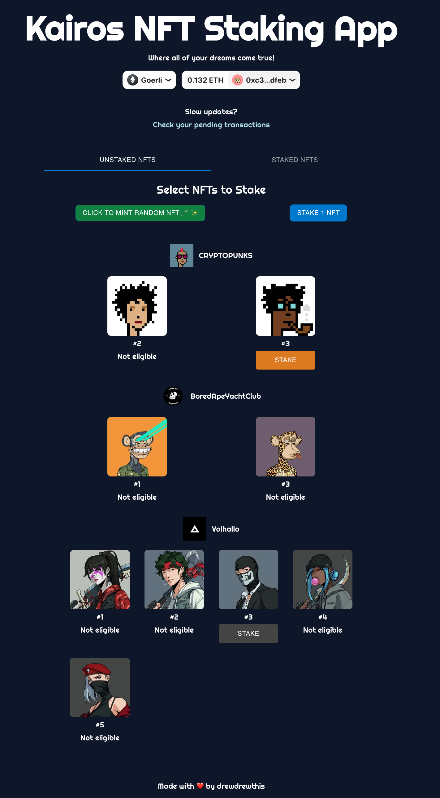
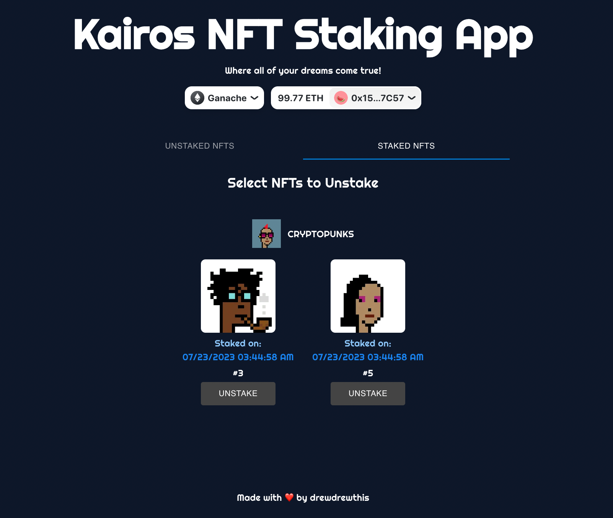

# Kairos Recruitment Test for Fullstack Blockchain Engineer

This project was completed as part of a comprehensive recruitment test for [Kairos](https://kairos.loan). The project consists of two primary components, housed in their respective directories: `contracts` and `front-next`.

Please see the [instructions](./INSTRUCTIONS.md) for more info.

This README will provide a general overview of the project and links to more specific README files in the `contracts` and `front-next` directories.

## TL;DR

```bash
NETWORK=goerli sh bootstrap.sh && sh start.sh
```

or for development

```bash
NETWORK=goerli sh bootstrap.sh && sh start.sh --dev
```

## Table of Contents

1. [Project Structure](#project-structure)
2. [Environment Configuration](#environment-configuration)
3. [Common Scripts](#common-scripts)
4. [Troubleshooting](#troubleshooting)
5. [Contributing](#contributing)
6. [License](#license)
7. [Screenshots](#screenshots)

## Project Structure

- `contracts`: This directory contains smart contract code and deployment scripts. More information can be found in the [`contracts` README](./contracts/README.md).
- `front-next`: This directory contains the frontend built with NextJS, TailwindCSS, and MUI. More information can be found in the [`front-next` README](./front-next/README.md).

## Environment Configuration

There is a shared `.env` file at the top level of the project, containing configurations that both `contracts` and `front-next` directories use. For specific environment configurations, refer to the README files in the respective directories.

## Development Environment Setup

For running a local EVM via Ganache, see [`contracts` README](./contracts/README.md)

Please refer to the specific README files in the `contracts` and `front-next` directories for more information on contract deployment and application setup.

## Common Scripts

The script `copy_generated_abis.sh` at the top level copies the necessary ABI files from the `contracts` directory into the `front-next/src/__generated/contracts` directory.

For more detailed information about scripts, please refer to the README files in the respective `contracts` and `front-next` directories.

## Troubleshooting

If you encounter any issues while setting up or using this project, please refer to the troubleshooting sections in the `contracts` and `front-next` README files.

## License

This project is licensed under the [MIT license](./LICENSE).

---

## Screenshots




